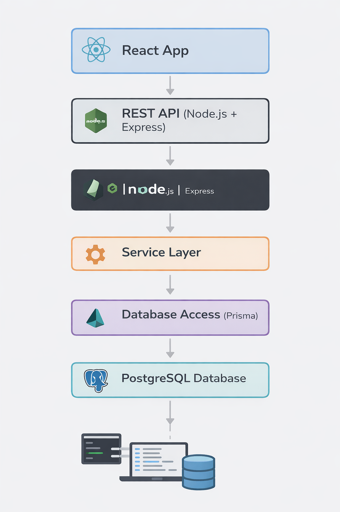
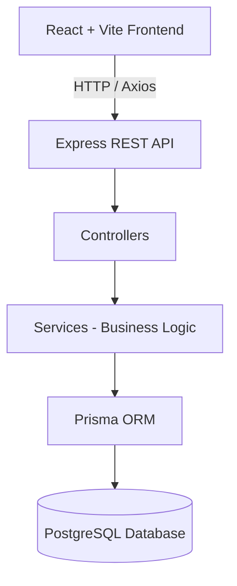
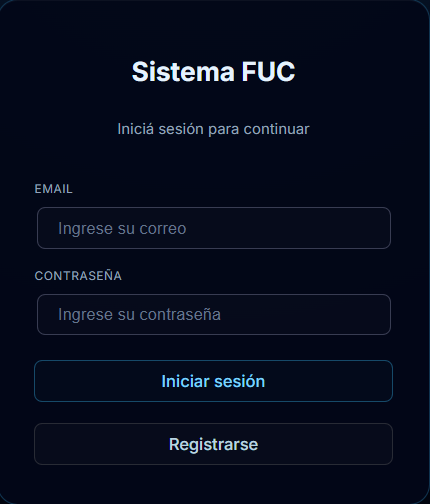
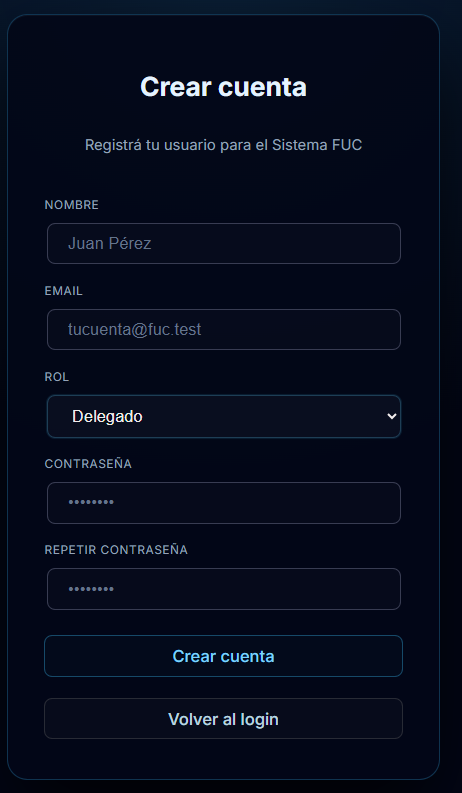
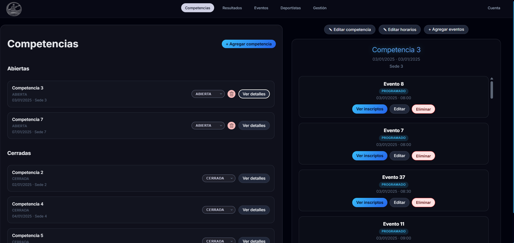
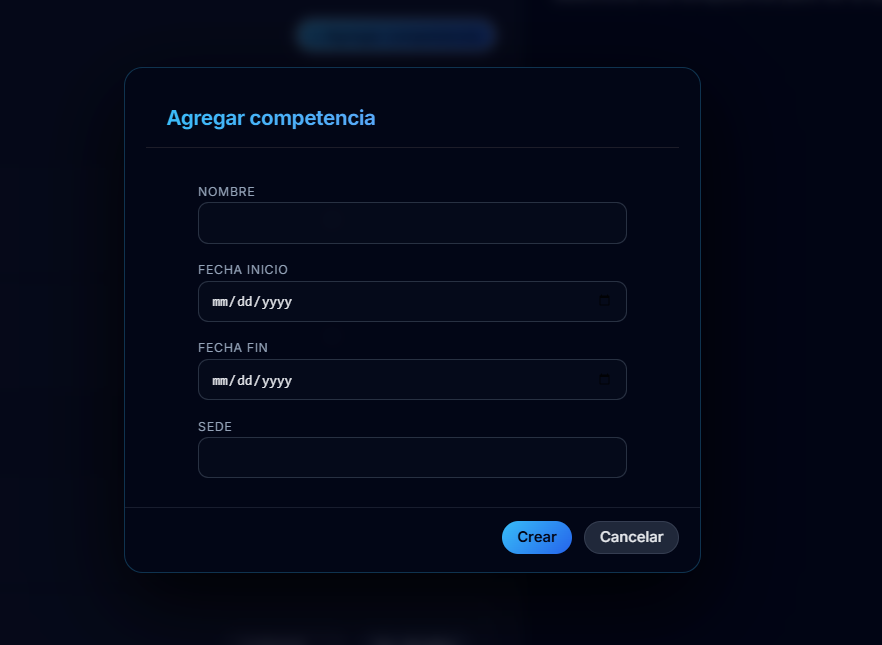
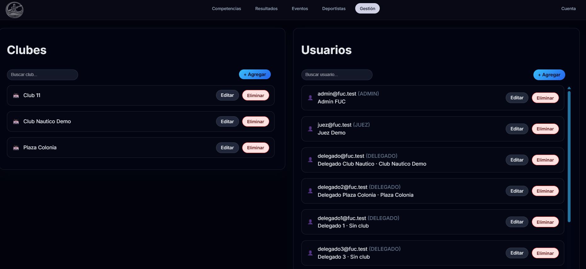
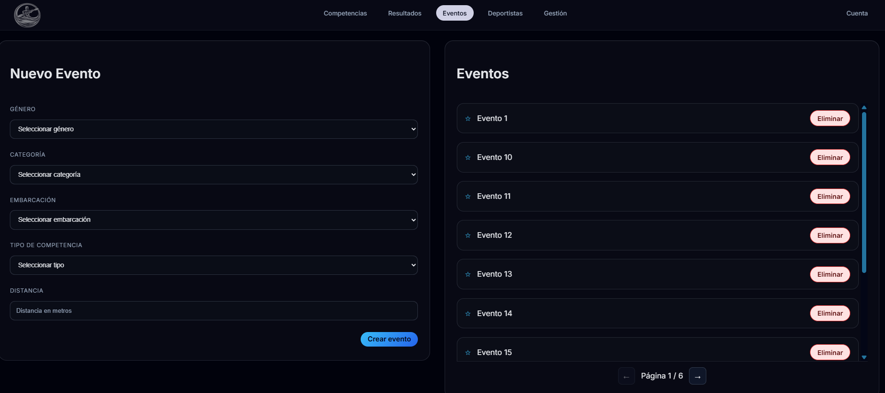
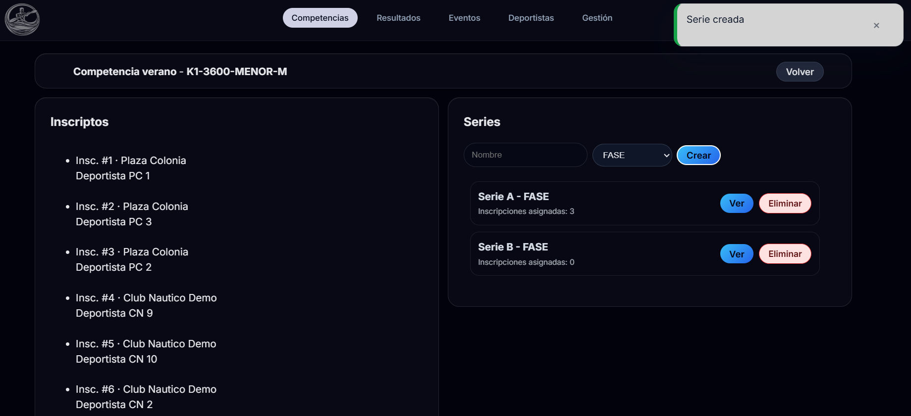
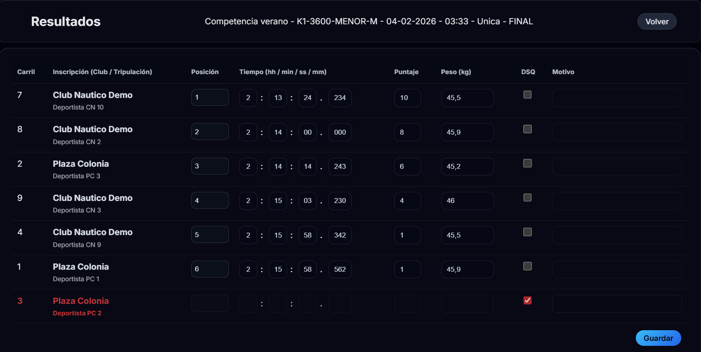

# FUC Management System – Technical Overview

## Project Context

This project consists of a web-based management system developed for the Uruguayan Canoeing Federation (FUC).  
The objective was to replace manual competition management processes with a centralized, structured and role-based digital platform.

The system manages:
- Competition administration
- Event scheduling
- Athlete registrations
- Result publication
- Role-based access control for different user profiles

---

## System Architecture

The system follows a layered backend architecture with clear separation of responsibilities.

Frontend (React + Vite)
→ Axios HTTP Client
→ REST API (Node.js + Express)
→ Controllers
→ Services (Business Logic)
→ Repositories (Prisma ORM)
→ PostgreSQL Database

<!-- 
The system follows a layered architecture separating presentation, business logic and data access concerns. -->




### Architectural Principles

- Layered architecture (Controller / Service / Repository)
- DTO-based data transfer
- Clear separation between business logic and persistence
- Role-Based Access Control (RBAC)
- Server-side validation
- Centralized error handling

---

## Technology Stack

### Backend
- Node.js
- TypeScript
- Express
- Prisma ORM
- JWT Authentication

### Database
- PostgreSQL
- Relational model with 15+ entities
- Foreign key constraints and referential integrity
- Use of transactions for atomic operations

### Frontend
- React
- Vite
- React Router
- Axios

### Infrastructure
- Docker / Docker Compose
- Nginx (reverse proxy)
- AWS EC2 deployment
- Environment-based configuration (dev / prod)

---

## Security Model

Authentication is implemented using JWT tokens.

Authorization follows a Role-Based Access Control (RBAC) approach with three system roles:
- Administrator
- Judge
- Delegate

Access to endpoints is controlled through middleware validation.

---

## Database Design

The relational model includes more than 15 entities representing the federation domain, including:

- Users
- Roles
- Clubs
- Athletes
- Competitions
- Events
- Series
- Registrations
- Results

All relationships are defined using foreign keys and integrity constraints to ensure consistency.

---

## Example API Endpoints

```http
POST   /api/auth/login
GET    /api/competitions
POST   /api/registrations
GET    /api/events/{id}
```

## Technical Decisions

- Adopted a layered architecture (Controller / Service / Repository) to ensure separation of concerns and maintainability.
- Used Prisma ORM to manage relational data and ensure type safety within a PostgreSQL database.
- Implemented JWT-based authentication to enable stateless authorization.
- Applied Zod for request validation to enforce strict input schemas.
- Centralized error handling to avoid duplicated logic across controllers.
- Shared certain frontend views between roles to avoid code duplication and improve maintainability.
- Used database transactions for operations involving multiple related entities to ensure atomicity and consistency.

## Technical Challenges

- Designing a relational schema capable of handling competitions, events, registrations and results without data inconsistencies.
- Implementing a many-to-many relationship for athlete registrations through a pivot table (InscripcionMiembro).
- Managing authorization rules depending on both user role and entity status.
- Structuring the backend to prevent tight coupling between business logic and persistence.

## Requirements and Iteration Process

The system was developed based on real institutional requirements gathered through meetings with federation representatives.

Multiple iterations were conducted to refine functionality, adjust business rules and improve usability according to stakeholder feedback.

## Development Workflow

- Git-based version control with branch separation (main / develop / feature branches).
- Environment separation using dedicated configuration files (.env.dev / .env.prod).
- CI/CD integration for automated deployment.
- Containerized development environment using Docker Compose.

## Deployment

The application is containerized using Docker and deployed to AWS EC2.

- Reverse proxy configuration using Nginx.
- Secure environment variable management.
- Production and development configurations separated.

### Screenshots

 ---

## Login


## Register


### Competition Flow 1


### Add Competition (admin only)


### Administration (admin only)


## Events managment (admin only)


## Series managment


## Results managment


## Author
Developed as part of a real institutional software solution.  
Technical walkthrough available upon request.
Nicolás Recoba.